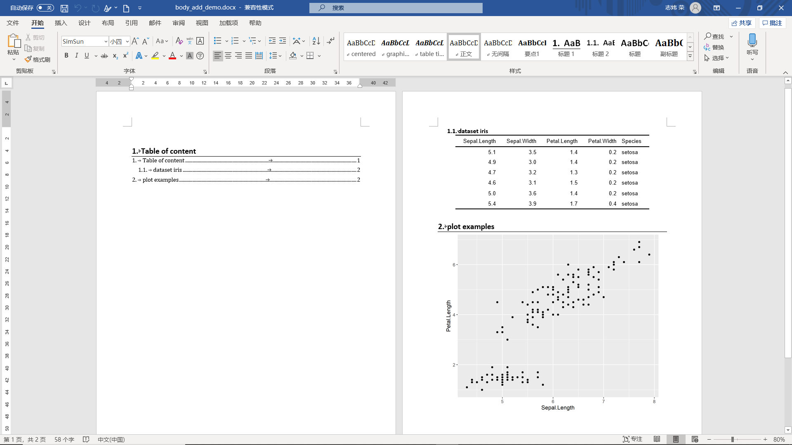

Introduction
================
Lu Yiyun
2020/1/1

  - [1. 介绍](#介绍)
  - [2. 基本使用逻辑](#基本使用逻辑)
  - [3. 注意事项](#注意事项)

# 1\. 介绍

`officer`是一个用来在R中控制Word、PowerPoint文件的工具包。其配合其他一些辅助包，可以在R中实现将结果直接输出至Word文件、制作ppt等任务。另外，查看其函数列表，发现其也有excel的支持，但其官方介绍网站中主要介绍的是Word和PowerPoint的操作，想来excel作为处理表格的工具和R本身的语言功能有所重叠，也有可能有其他工具包已经提供了支持，`officer`对其兴趣不大。

# 2\. 基本使用逻辑

操作思路类似`dplyr`。

1.  其会首先使用`read_*`系列函数创建一个表示Office文件的对象，用于其所有函数的第一个参数，这个对象类似`dplyr`中的`data.frame`；
2.  其他所有的函数都以其为第一个参数，目的是对其进行修改，比如增加内容、图片、删除内容等，这些函数会返回更改过后的Office文件R对象；
3.  当我们想要将这个R对象实现为一个Office文件的时候，我们可以使用`print`函数，其中输入输出文件的路径即可；

因为大多数函数的第一个就是Office文件R对象，所以类似`dplyr`，当我们对于Office文件的操作是一系列串联的事件时，我们可以使用管道符`%>%`将这些操作连接，使我们的代码更加清晰、简洁、明了。比如以下的例子：

``` r
library(officer)
library(magrittr)
library(ggplot2)
library(flextable)

# 事先创建好要输入到word文件中的内容
gg <- ggplot(data = iris, aes(Sepal.Length, Petal.Length)) + 
  geom_point()
ft <- qflextable(head(iris))

# 创建文件
read_docx() %>%
  # 增加第一段内容
  body_add_par(value = "Table of content", style = "heading 1") %>% 
  body_add_toc(level = 2) %>% 
  body_add_break() %>% 

  # 增加第二段内容，是表格
  body_add_par(value = "dataset iris", style = "heading 2") %>% 
  body_add_flextable(value = ft ) %>% 
  
  # 增加第三段内容，是图片
  body_add_par(value = "plot examples", style = "heading 1") %>% 
  body_add_gg(value = gg, style = "centered" ) %>% 

  # 输出结果
  print(target = "./body_add_demo.docx")
```

其呈现在word中的结果是这样的：

# 3\. 注意事项

我当前还没有太多的使用过这个包，所以对其注意事项只能在使用中慢慢总结补充：

  - 注意添加进Word文档中的内容是否存在一些特殊符号，比如斜杠、反斜杠等，其可能会导致中文unicode解码错误；
  - 输入的表格可能大小并不适应，需要自己调整；
  - 如果表格有些内容希望空着，可以使用`NA_character_`，如果是其他类型的`NA`，会强行输出成`NA`字符串。
