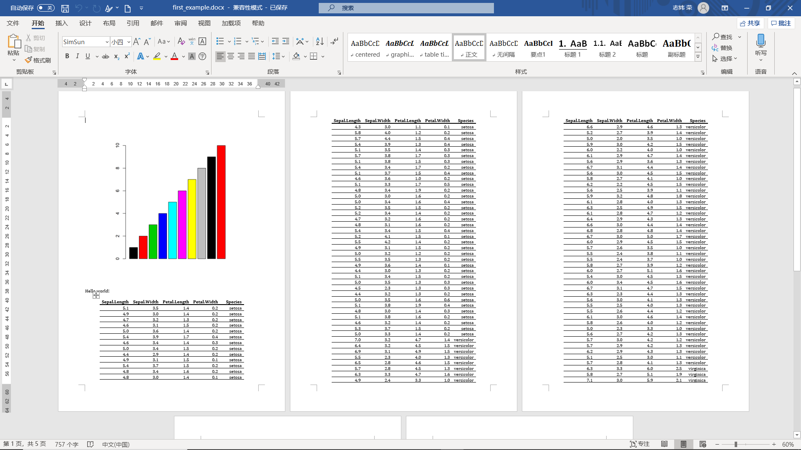
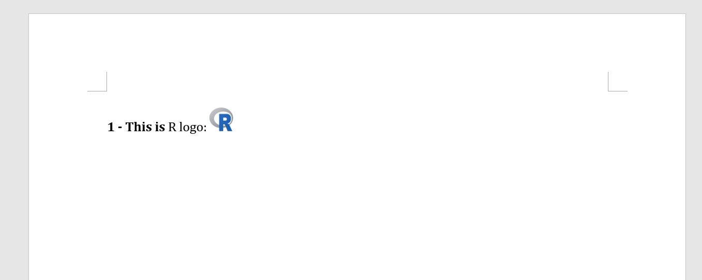

Word
================
荣志炜
2020/1/1

  - [1. Quick start](#quick-start)
  - [2. 增加元素](#增加元素)

# 1\. Quick start

1.  创建一个rdocx对象，通过`read_docx(path =
    NULL)`，参数`path`如果为空，则代表创建了一个空的docx文件，如果指定了一个已存在的docx文件，则创建的rdocx对象中会保存这个docx文件的内容，便于进一步修改；

<!-- end list -->

``` r
library(officer)

my_doc <- read_docx()
str(my_doc)
## List of 2
##  $ package_dir   : chr "C:\\Users\\hasee\\AppData\\Local\\Temp\\RtmpcnWxdj\\file3d8076fb7eed"
##  $ doc_properties:List of 2
##   ..$ data: chr [1:10, 1:4] "dc" "dc" "dc" "cp" ...
##   .. ..- attr(*, "dimnames")=List of 2
##   .. .. ..$ : chr [1:10] "title" "subject" "creator" "keywords" ...
##   .. .. ..$ : chr [1:4] "ns" "name" "attrs" "value"
##   ..$ ns  : Named chr [1:5] "http://schemas.openxmlformats.org/package/2006/metadata/core-properties" "http://purl.org/dc/elements/1.1/" "http://purl.org/dc/dcmitype/" "http://purl.org/dc/terms/" ...
##   .. ..- attr(*, "names")= chr [1:5] "cp" "dc" "dcmitype" "dcterms" ...
##   ..- attr(*, "class")= chr "core_properties"
##  - attr(*, "class")= chr "rdocx"
```

我们会进一步对其进行修改，比如增加一些段落等等。这里提前告知一下，我们可以通过函数`style_info`作用于任何一个rdocx对象来看到我们可以操作的内容，以及这些内容的可选格式：

``` r
styles_info(my_doc)
##    style_type            style_id             style_name is_custom
## 1   paragraph              Normal                 Normal     FALSE
## 2   paragraph              Titre1              heading 1     FALSE
## 3   paragraph              Titre2              heading 2     FALSE
## 4   paragraph              Titre3              heading 3     FALSE
## 5   character      Policepardfaut Default Paragraph Font     FALSE
## 6       table       TableauNormal           Normal Table     FALSE
## 7   numbering         Aucuneliste                No List     FALSE
## 8   character              strong                 strong      TRUE
## 9   paragraph            centered               centered      TRUE
## 10      table       tabletemplate         table_template      TRUE
## 11      table Listeclaire-Accent2    Light List Accent 2     FALSE
## 12  character           Titre1Car            Titre 1 Car      TRUE
## 13  character           Titre2Car            Titre 2 Car      TRUE
## 14  character           Titre3Car            Titre 3 Car      TRUE
## 15  paragraph        graphictitle          graphic title      TRUE
## 16  paragraph          tabletitle            table title      TRUE
## 17      table       Professionnel     Table Professional     FALSE
## 18  paragraph                 TM1                  toc 1     FALSE
## 19  paragraph                 TM2                  toc 2     FALSE
## 20  paragraph       Textedebulles           Balloon Text     FALSE
## 21  character    TextedebullesCar    Texte de bulles Car      TRUE
## 22  character         referenceid           reference_id      TRUE
##    is_default
## 1        TRUE
## 2       FALSE
## 3       FALSE
## 4       FALSE
## 5        TRUE
## 6        TRUE
## 7        TRUE
## 8       FALSE
## 9       FALSE
## 10      FALSE
## 11      FALSE
## 12      FALSE
## 13      FALSE
## 14      FALSE
## 15      FALSE
## 16      FALSE
## 17      FALSE
## 18      FALSE
## 19      FALSE
## 20      FALSE
## 21      FALSE
## 22      FALSE
```

2.  往rdocx中创建内容。这里有多种函数来为其添加不同的内容，其中最常用的是`body_add_par`，其中`par`表示的是paragraph（段落）。也可以添加图片：

<!-- end list -->

``` r
# 创建一个临时的图片
src <- tempfile(fileext = ".png")
png(filename = src, width = 5, height = 6, units = 'in', res = 300)
barplot(1:10, col = 1:10)
dev.off()
## png 
##   2
# 将这个图片和一些文字加入到rdocx中
my_doc <- my_doc %>% 
  body_add_img(src = src, width = 5, height = 6, style = "centered") %>% 
  body_add_par("Hello world!", style = "Normal") %>% 
  body_add_par("", style = "Normal") %>% # blank paragraph
  body_add_table(iris, style = "table_template")
```

默认这些内容都添加在文件的后面，至于如何在任意位置添加内容，就需要设计cursor的操作，这在下面会讲到。

3.  最后使用`print(path=..)`来将rdocx对象变成真实的docx文件：

<!-- end list -->

``` r
print(my_doc, "./first_example.docx")
```

最后的结果展示

# 2\. 增加元素

这里有两类函数来增加元素：

  - **增加的内容是top container，使用的是`body_add_*`函数**：
      - `body_add_par(x, value, style = NULL, pos =
        "after")`，加入一个文字段落，`pos`表示的是加入的内容再光标（cursor）之前还是光标之后，
        `style`是段落的风格名称，是`styles_info`输出的“style\_name”一列；
      - `body_add_img(x, src, style = NULL, width, height, pos =
        "after")`，`src`是file的路径；
      - `body_add_table(x, value, style = NULL, pos = "after", header =
        TRUE, first_row = TRUE, first_column = FALSE, last_row = FALSE,
        last_column = FALSE, no_hband = FALSE, no_vband = TRUE)`，添加表格；
      - `body_add_break(x, pos = "after")`，添加一个分页符；
      - `body_add_toc(x, level = 3, pos = "after", style = NULL,
        separator = ";")`，添加一个目录；
      - `body_add_gg(x, value, width = 6, height = 5, style = NULL,
        ...)`，添加一个ggplot对象到word中，其作为一个png图像被插入到其中，`...`表示会输入到`png()`中的参数；
      - `body_add_fpar(x, value, style = NULL, pos =
        "after")`，增加fpar到word中；
      - `body_add_blocks(x, blocks, pos =
        "after")`，将`block_list`创建的`block`对象（表示的是多个段落或图片的合集）添加到rdocx中；
      - `flextable::body_add_flextable(x, value, align = "center", pos =
        "after", split =
        FALSE)`，这来自于`flextable`，使得我们可以添加更加漂亮的表格到word文档中；
  - **将文字或图片插入到已经存在的段落中，使用的是`slip_in_*`系列函数**，其只能做到在存在的段落的前面或后面添加内容，添加的内容还是算作在这个段落中的，可能实现在一个段落中出现不同格式的文字（比如实现表头和图片标题的时候是非常需要的）：
      - `slip_in_img(x, src, style = NULL, width, height, pos =
        "after")`，添加图片，这里的`pos`表示的是段落的开头还是段落的结尾；
      - `slip_in_text(x, str, style = NULL, pos = "after", hyperlink =
        NULL)`，添加文字，这里可以将文字变成超链接；
      - `slip_in_seqfield(x, str, style = NULL, pos = "after")`，???；
      - `slip_in_footnote(x, style = NULL, blocks, pos =
        "after")`，添加脚注，其中脚注的内容是blocks定义的；
      - `slip_in_column_break(x, pos = "before")`，添加分栏符；
      - `slip_in_xml(x, str, pos)`，添加一个wml string到rdocx中；

这是关于`body_add_*`的演示，其结果在[Introduction](./introduction.md)中有展示，就不再展示了：

``` r
library(ggplot2)
library(flextable)

# body_add_*应用试验
gg <- ggplot(data = iris, aes(Sepal.Length, Petal.Length)) + 
  geom_point()
ft <- qflextable(head(iris))
read_docx() %>% 
  body_add_par(value = "Table of content", style = "heading 1") %>% 
  body_add_toc(level = 2) %>% 
  body_add_break() %>% 

  body_add_par(value = "dataset iris", style = "heading 2") %>% 
  body_add_flextable(value = ft ) %>% 
  
  body_add_par(value = "plot examples", style = "heading 1") %>% 
  body_add_gg(value = gg, style = "centered" ) %>% 

  print(target = "./body_add_demo.docx")
```

这是关于`slip_in_*`函数的展示，其结果展示在下面：

``` r
# slip_in_*应用试验
img.file <- file.path( R.home("doc"), "html", "logo.jpg" )
read_docx() %>%
  body_add_par("R logo: ", style = "Normal") %>%
  slip_in_img(src = img.file, style = "strong", 
              width = .3, height = .3, pos = "after") %>% 
  slip_in_text(" - This is ", style = "strong", pos = "before") %>% 
  slip_in_column_break(pos = "after") %>% 
  slip_in_seqfield(str = "SEQ Figure \u005C* ARABIC",
    style = 'strong', pos = "before") %>% 
  print(target = "./slip_in_demo.docx")
```


